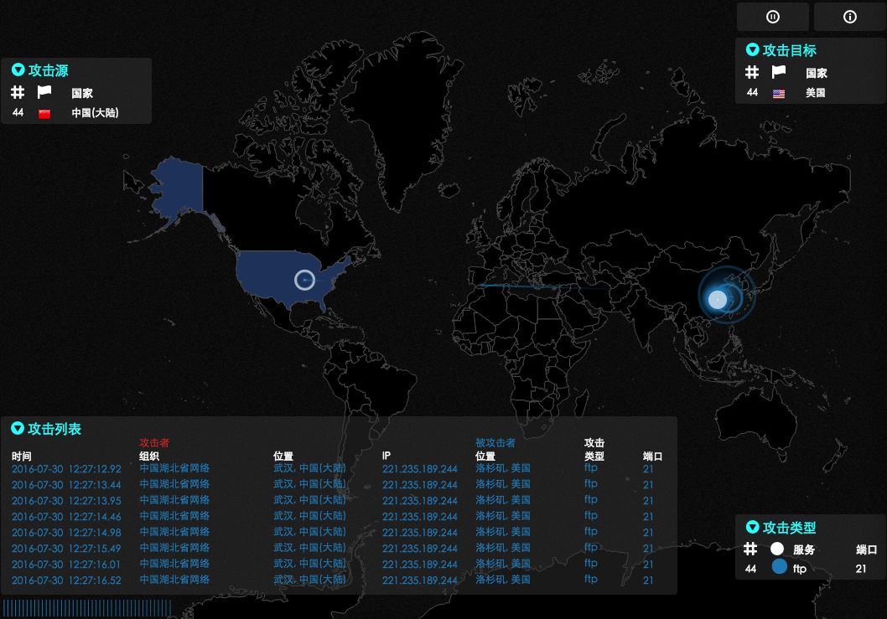
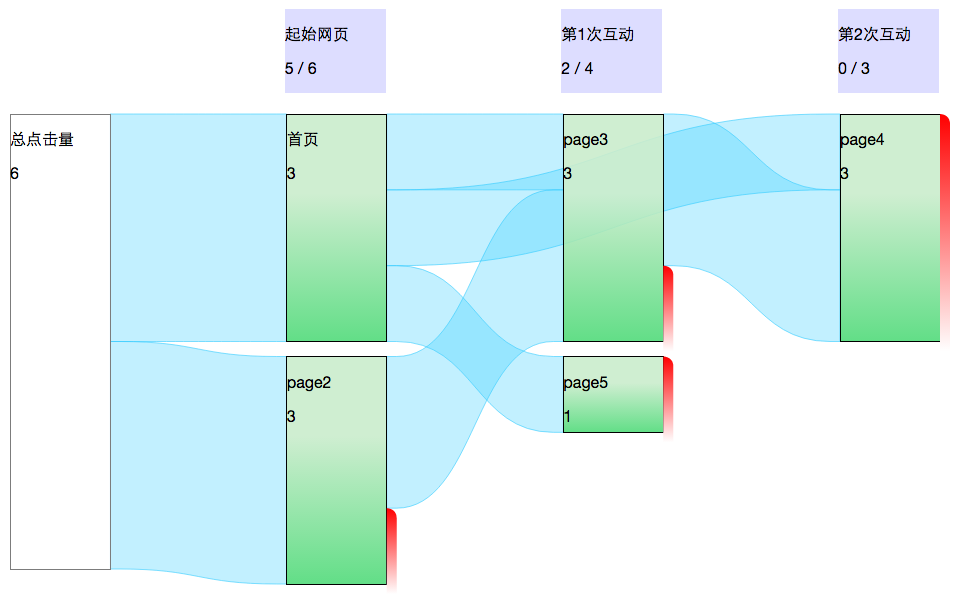

# data-visualization
数据可视化：基于d3.js 或 fabric.js 等

## 项目

### 图片标定

calibrationbox：一个 [Fabric](http://fabricjs.com/) 的小插件，可用于标定图片中车辆、人、交通灯标识、区域等。详见，[calibration-box](https://github.com/TingGe/calibration-box) 项目。

### 网络攻击地图

- norsecorp

- ipviking

  

### 访问者流报告

netflow：借鉴 Google Analytics 行为流 ，修改自 [netFlow](https://github.com/jdk137/netFlow/)

## 运行

1. 依赖 [Node](https://nodejs.org/)、[http-server](https://github.com/indexzero/http-server)
2. 在 data-visualization/server 目录执行 `npm install` 后，运行 `npm start` 启动（默认9999端口）
3. 在 data-visualization 目录执行 `http-server`
4. 根据 `http-server` 中提示的网址，在浏览器（建议 Chrome ）中访问
5. 关闭命令窗口即可退出

## 附录

- [Sankey Diagrams](https://bost.ocks.org/mike/sankey/)
- [读书笔记 - 数据可视化实践](http://blog.lyuehh.com/book/2013/05/25/reading-notes-Interactive-Data-Visualization.html)
- [F1 Championship Points as a d3.js Powered Sankey Diagram](https://blog.ouseful.info/2012/05/24/f1-championship-points-as-a-d3-js-powered-sankey-diagram/)
- [前端模块化开发DEMO之攻击地图](http://fuxiaode.cn/blog/2015/12/05/attack-map-with-amd)：推荐 @[依宁](https://github.com/danislyn) 的一版[攻击地图](http://fuxiaode.cn/demo/AttackMap/index.html)，感觉不错！
- [konva](http://konvajs.github.io/)：呈现能力不错，但与  [Fabric](http://fabricjs.com/) 相比交互较弱。

## 反馈

[https://github.com/TingGe/data-visualization/issues](https://github.com/TingGe/data-visualization/issues)

## 贡献

[https://github.com/TingGe/data-visualization/graphs/contributors](https://github.com/TingGe/data-visualization/graphs/contributors)

## 许可

(The MIT License)

Copyright (c)  Ting Ge [505253293@163.com](mailto:505253293@163.com)

