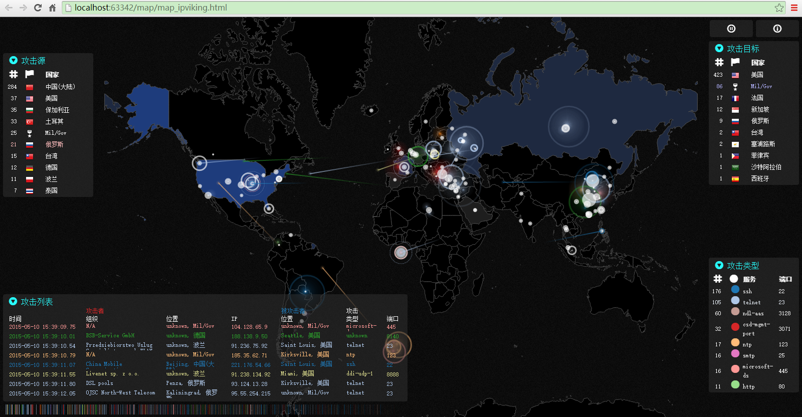
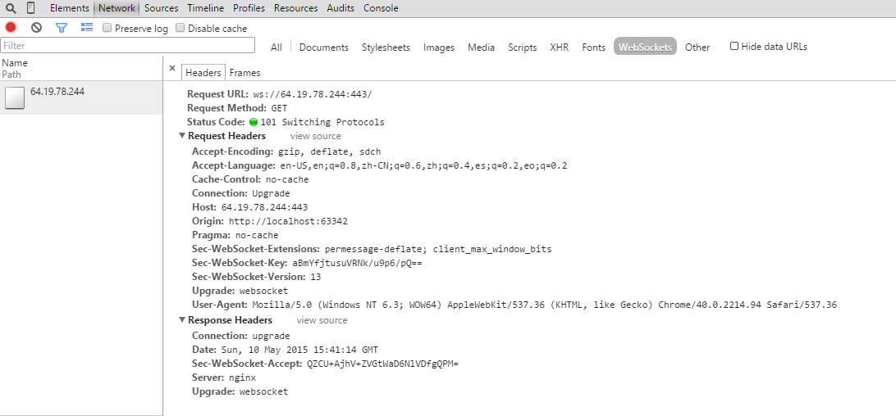
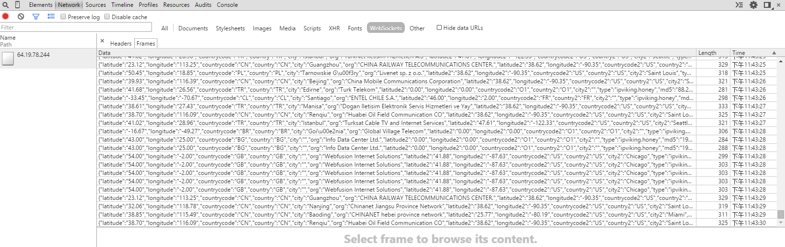

# 实时网络攻击地图 #

Realtime Attack Trackers

## Norse - IPViking Map 源码改进与解析  ##

Demo截图

Websocket实时通讯协议 

Browser设置示例：

    wsHost: "ws://64.19.78.244:443/",                   //WebSocket API主机
    psk: "18c989796c61724d4661b019f2779848dd69ae62",    //Sec-WebSocket-Key

Server推送数据示例：

    {
        "latitude": "30.58",                        //源纬度
        "longitude": "114.27",                      //源经度 
        "countrycode": "CN",                        //源国家地区编码，参见 country-codes.csv
        "country": "CN",                            //源国家，参见 country-codes.csv
        "city": "Wuhan",                            //源城市
        "org": "CHINANET HUBEI PROVINCE NETWORK",   //源组织
        "latitude2": "38.62",                       //目标纬度
        "longitude2": "-90.35",                     //目标经度
        "countrycode2": "US",                       //目标国家地区编码，参见 country-codes.csv
        "country2": "US",                           //目标国家，参见 country-codes.csv
        "city2": "Saint Louis",                     //目标城市
        "type": "ipviking.honey",                   //仅标识地图类型，参见 [HoneyMap]("http://map.honeynet.org/")
        "md5": "221.235.189.244",                   //源IP地址
        "dport": "22",                              //攻击的端口，参见port-names.tsv
        "svc": "ssh",                               //攻击类型（服务）名称，参见port-names.tsv
        "zerg": "rush"                              //？
    }

## 参考 ##

1. [http://map.norsecorp.com/](http://map.norsecorp.com/)

2. [http://map.ipviking.com/](http://map.ipviking.com/)

3. [Norse](http://www.norse-corp.com/)： 实时、清晰地清晰地了解全球网络攻击

4. [Norse 博客](http://blog.norsecorp.com/)

5. [HoneyMap](http://map.honeynet.org/)

6. [Who’s Attacking Whom? Realtime Attack Trackers](http://krebsonsecurity.com/2015/01/whos-attacking-whom-realtime-attack-trackers/)

7. [Faux-3D Arcs](http://bl.ocks.org/dwtkns/4973620) 

